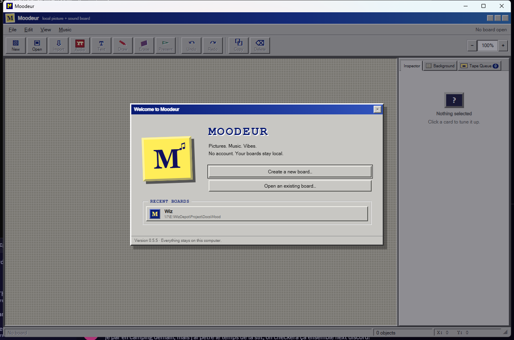
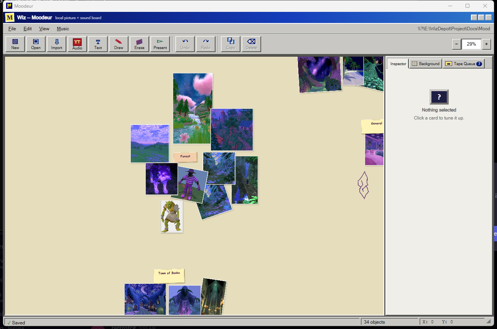

# Moodeur

[](https://github.com/Zeclown/Moodeur/actions/workflows/ci.yml)
[](https://github.com/Zeclown/Moodeur/actions/workflows/codeql.yml)
[](https://github.com/Zeclown/Moodeur/releases/latest)
[](LICENSE)

Moodeur is a small, local-first moodboard for Windows and macOS. It combines a freeform picture canvas with playable music cards and stores everything in a portable folder that you control.





## What it does

- Arrange pictures freely on an infinite canvas with notes and marker drawings.
- Add playable music cards and build a looping tape queue for each board.
- Customize the canvas and turn a board into a focused picture-and-sound presentation.
- Import common image and audio formats while Moodeur autosaves and maintains a recovery backup.
- Keep everything in portable local folders, with no account, cloud storage, or analytics.

## Download

Download the latest unsigned packages from
[GitHub Releases](https://github.com/Zeclown/Moodeur/releases/latest):

| Platform | Package |
| --- | --- |
| Windows 10/11 x64 | NSIS setup executable |
| macOS 12+ Apple Silicon | DMG or app archive |
| macOS 12+ Intel | DMG or app archive |

Windows SmartScreen or macOS Gatekeeper may warn before first launch because
these community builds are not code-signed. Each release includes
`SHA256SUMS.txt` and GitHub artifact attestations. To verify provenance with
the GitHub CLI:

```powershell
gh attestation verify .\Moodeur-download --repo Zeclown/Moodeur
```

## Board folders

When creating a board, select a folder that Moodeur can use. It will contain:

```text
Your Board Folder/
├── moodeur.json
├── moodeur.json.bak
└── media/
    ├── generated-id.png
    └── generated-id.mp3
```

Imported originals and recorded YouTube audio are copied into `media/`; source files are never modified. Deleting a card does not delete its copied media, so undo and recovery remain safe.

## Keyboard and mouse

| Action | Shortcut |
| --- | --- |
| New / Open / Import / Save | `Ctrl`/`Cmd` + `N` / `O` / `I` / `S` |
| Undo / Redo | `Ctrl`/`Cmd` + `Z` / `Shift+Z` |
| Copy / Paste / Duplicate | `Ctrl`/`Cmd` + `C` / `V` / `D` |
| Copy a picture to the system clipboard | Right-click it, or select it and press `Ctrl`/`Cmd` + `C` |
| Select multiple cards | Left-drag an empty part of the canvas |
| Move selected group | Drag any selected card |
| Add handwritten text | `Ctrl`/`Cmd` + `T` |
| Draw marker / Scrub eraser / Select | `B` / `E` / `Escape` |
| Delete card | `Delete` or `Backspace` |
| Pan | Hold `Space` and drag, or middle-drag |
| Zoom | Mouse wheel, `+`, or `-` |
| Actual size / Frame all | `0` / `Home` |
| Start or exit presentation mode | `F5` |
| Previous / next presentation slide | `Left` or `Page Up` / `Right`, `Page Down`, `Space`, or `Enter` |
| Rotate | Drag the larger yellow handle; hold `Shift` to snap to 15°, or double-click it to reset to 0° |
| Edit a text note | Double-click it; `Enter` finishes and `Shift+Enter` adds a new line |

## Developer setup

Moodeur deliberately has no JavaScript package manager or frontend framework. Development requires only the platform prerequisites for Tauri and the Rust toolchain.

### Windows 10/11

1. Install Visual Studio 2022 Build Tools with **Desktop development with C++**.
2. Install Rust from [rustup.rs](https://rustup.rs/).
3. Install the Tauri command:

   ```powershell
   cargo install tauri-cli --version "^2" --locked
   ```

4. Run `./run.ps1` for development or `./build.ps1` for tests and an unsigned NSIS installer.

Moodeur uses the system WebView2 runtime instead of bundling a fixed copy. Current Windows 10 and Windows 11 installations normally include it.

### macOS 12+

1. Install Xcode Command Line Tools with `xcode-select --install`.
2. Install Rust from [rustup.rs](https://rustup.rs/).
3. Install the Tauri command with `cargo install tauri-cli --version "^2" --locked`.
4. Run `./build-macos.sh` on an Intel Mac and an Apple Silicon Mac to create architecture-specific unsigned app/DMG artifacts.

## Tests

Backend tests cover schema validation and migration, marker drawing limits and round-tripping, board-background validation, unsafe paths, Unicode board names, collision-safe imports, broken references, rolling backups, corrupt-primary recovery, recent boards, strict YouTube URL scoping, and download-progress parsing:

```powershell
cargo test --manifest-path src-tauri/Cargo.toml
```

## Bundled utilities

YouTube audio import invokes architecture-specific yt-dlp 2026.07.04 and QuickJS-NG 0.15.1 sidecars with fixed arguments. It accepts only HTTPS `youtube.com` and `youtu.be` links, never invokes a general shell, downloads one M4A track into a generated temporary directory, and copies the validated result into the board.

Upstream licenses, third-party notices, versions, source locations, and verified SHA-256 digests are included in `src-tauri/licenses/`. Only download material you own or have permission to use.

## Unsigned personal builds

These packages are intended for personal and test use. Windows may show a SmartScreen warning. On macOS, right-click the app and choose **Open** the first time. Public distribution would require Windows code signing and Apple Developer ID signing/notarization.

## Contributing and license

Contributions are welcome through checked pull requests. See
[CONTRIBUTING.md](CONTRIBUTING.md) for the development workflow and
[SECURITY.md](SECURITY.md) for private vulnerability reporting.

Moodeur is available under the [MIT License](LICENSE). Bundled sidecars retain
their upstream licenses, reproduced in `src-tauri/licenses/`.
